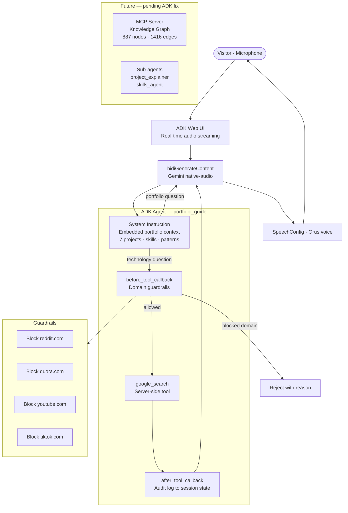

# 🎙️ PortfolioGuide Voice Agent

A live conversational voice agent that presents David's Agentic AI portfolio to visitors, built with Google ADK and the Gemini native-audio model. Visitors speak into their microphone and get instant, natural voice responses about 7 portfolio projects.

**Implemented features:** Real-time voice agent (Google ADK + Gemini native-audio) · Server-side web browsing via `google_search` · Domain guardrails (`before_tool_callback` blocks non-professional sources) · Audit logging (`after_tool_callback` tracks all searches in session state) · Custom voice persona (Orus via SpeechConfig) · Embedded portfolio knowledge for zero-latency context access

---

## Demo

https://github.com/user-attachments/assets/3da9e201-fa25-4b10-90ca-dc32a549e1a1

---

## Features

- **Real-time voice interaction** — Gemini native-audio model via `bidiGenerateContent`
- **Server-side web browsing** — `google_search` tool grounds technology explanations with current data
- **Domain guardrails** — `before_tool_callback` blocks Reddit, Quora, YouTube, TikTok
- **Audit logging** — `after_tool_callback` tracks all searches in session state
- **Custom voice persona** — SpeechConfig with prebuilt voice "Orus"
- **Embedded portfolio knowledge** — 7 projects with full context in system instruction for zero-latency access
- **MCP server + Knowledge Graph** (implemented, parked due to ADK bug) — 887 nodes, 1416 edges

---

## Architecture

> Architecture diagram: [`docs/architecture.mmd`](docs/architecture.mmd)

---

## Key Design Decisions

| Decision | Rationale |
|----------|-----------|
| **Embedded portfolio context** | ADK 2.1.0 has a confirmed bug — custom function/tool calls in live mode with native-audio models never emit the actual `function_call` event. Embedding context guarantees instant responses. |
| **Server-side `google_search`** | Works in live mode (no client-side round-trip needed). Grounds tech explanations with current web data. |
| **`before_tool_callback` guardrails** | Blocks non-professional domains — only official sources allowed. |
| **`after_tool_callback` audit log** | Every search query logged to `ToolContext.state` — no external infra needed. |
| **MCP server kept in codebase** | Knowledge graph (887 nodes, 1416 edges) ready for when ADK fixes live-mode tool calling. |

---

## Tech Stack

| Component | Technology |
|-----------|-----------|
| Agent framework | Google ADK 2.1.0 |
| Model | Gemini 2.5 Flash (native-audio) |
| Voice | SpeechConfig with prebuilt voice "Orus" |
| Server-side tool | `google_search` (grounding) |
| Knowledge graph (future) | FastMCP server + cached JSON graph |
| Language | Python 3.11+ |

---

## Source Code Access

This repository shows architecture and documentation only. For full source code access, [contact me on LinkedIn](https://www.linkedin.com/in/davidalmagro).
